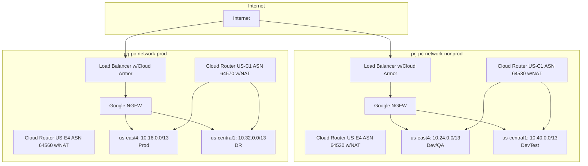

```mermaid
flowchart TD
subgraph Internet
    A[Internet]
end

subgraph Non_Prod_VPC["prj-pc-network-nonprod"]
    NP_LB[Load Balancer w/Cloud Armor]
    NP_R_US_E[Cloud Router US-E4 ASN 64520 w/NAT]
    NP_R_US_C[Cloud Router US-C1 ASN 64530 w/NAT]
    NP_LB --> NP_NGFW[Google NGFW]
    NP_NGFW --> NP_Sub_US_E[us-east4: 10.24.0.0/13<br>Dev/QA]
    NP_NGFW --> NP_Sub_US_C[us-central1: 10.40.0.0/13<br>DevTest]
    NP_R_US_C ---> NP_Sub_US_E
    NP_R_US_C ---> NP_Sub_US_C
end

subgraph Prod_VPC["prj-pc-network-prod"]
    P_LB[Load Balancer w/Cloud Armor]
    P_R_US_E[Cloud Router US-E4 ASN 64560 w/NAT]
    P_R_US_C[Cloud Router US-C1 ASN 64570 w/NAT]
    P_LB --> P_NGFW[Google NGFW]
    P_NGFW --> P_Sub_US_E[us-east4: 10.16.0.0/13<br>Prod]
    P_NGFW --> P_Sub_US_C[us-central1: 10.32.0.0/13<br>DR]
    P_R_US_C ---> P_Sub_US_E
    P_R_US_C ---> P_Sub_US_C
end

A --> NP_LB
A --> P_LB
```