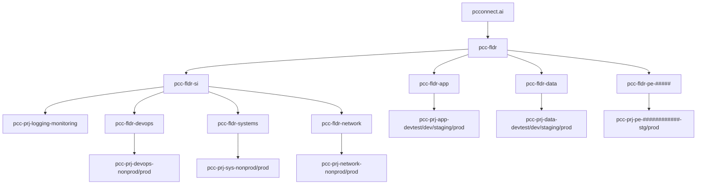

```mermaid
flowchart TD
    A["pcconnect.ai"] --> B["pcc-fldr"]
    B --> C["pcc-fldr-si"]
    B --> D["pcc-fldr-app"]
    B --> E["pcc-fldr-data"]
    B --> F["pcc-fldr-pe-#####"]
    C --> G["pcc-prj-logging-monitoring"]
    C --> H["pcc-fldr-devops"]
    C --> I["pcc-fldr-systems"]
    C --> J["pcc-fldr-network"]
    H --> K["pcc-prj-devops-nonprod/prod"]
    D --> L["pcc-prj-app-devtest/dev/staging/prod"]
    E --> M["pcc-prj-data-devtest/dev/staging/prod"]
    I --> O["pcc-prj-sys-nonprod/prod"]
    J --> P["pcc-prj-network-nonprod/prod"]
    F --> Q["pcc-prj-pe-############-stg/prod"]
```